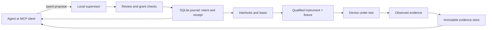

# Architecture

Cheirismos separates reasoning about a device from the local system that can
change it. Existing agents select experiments and interpret evidence; one local
supervisor owns access to instruments and the durable physical-effect boundary.

## Core boundary

The supervisor admits an effect only after it can bind a target, commissioned
profile, active grant, reviewed plan, exclusive lease, required evidence, and
interlocks. It persists an idempotent attempt identity and intent before I/O.
It then observes and records the result. An unresolved intent is reconciled
from fresh device evidence, not retried because a client repeats a request.

SQLite in WAL mode with `synchronous=FULL` is the authoritative journal. Large
artifacts are immutable and content-addressed; the database records their
digests and provenance after the artifact is durable. This gives a resumed
agent a case state it can inspect without reconstructing a chat history.

## Capability qualification

An instrument driver, a fixture, and a target profile are distinct. A protocol
binding does not prove electrical behavior; a healthy instrument does not
commission a fixture; and a commissioned fixture for one target does not
transfer to another. Qualification records the exact physical mapping, limits,
and observed behavior that make an operation available.

Physical intake and platform work may proceed in parallel. The platform does
not wait for a bench to model cases, preserve evidence, simulate operations, or
validate admission and recovery behavior. Conversely, no unqualified physical
operation is enabled merely because the software is ready.

## Dependency direction

Case-wide evidence analysis has no global dependency on any one firmware domain
or reference device. A particular experiment declares the evidence it needs;
for example, acquisition of a controller-domain image or comparison with a
reference board can be valuable branches, but neither blocks unrelated
observations, intake, artifact analysis, or simulator work.

Historical attempts are evidence. Exhausted procedures remain in the case
ledger with their scope and observations so a new agent does not repeat them as
new work. A new, precisely differentiated procedure may be proposed and
reviewed without rewriting history.

## Public and private data

The public repository contains executable contracts, simulations, fixtures-as-
types, and generic documentation. Case records, raw device reads, private
identifiers, credentials, and candidate artifacts reside in restricted local
storage with their own retention and backup policy.
